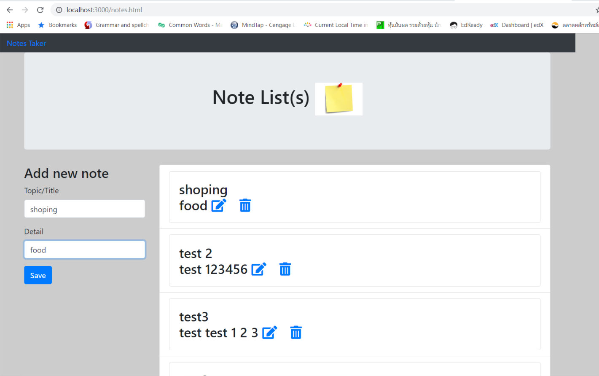

# Note_Taker

In application, user can create a node and delete it form page. This app use Express to handle routing and server HTML as well as JSON. MySQL to store notes, and jQuery for AJAX requests and handling other front-end logic.

# Screenshort

After run ```nodemon server.js ``` then it will display homepage screen follow this picture below.


click `start` button then it will display next page called `note.html` follow picture below.



The app will update link to mySQL in the server follow picture below.


# Link to webpage

https://nan227.github.io/Note_Taker/public/home.html


# Video

[](https://youtu.be/c1QXQlRGxp8)


